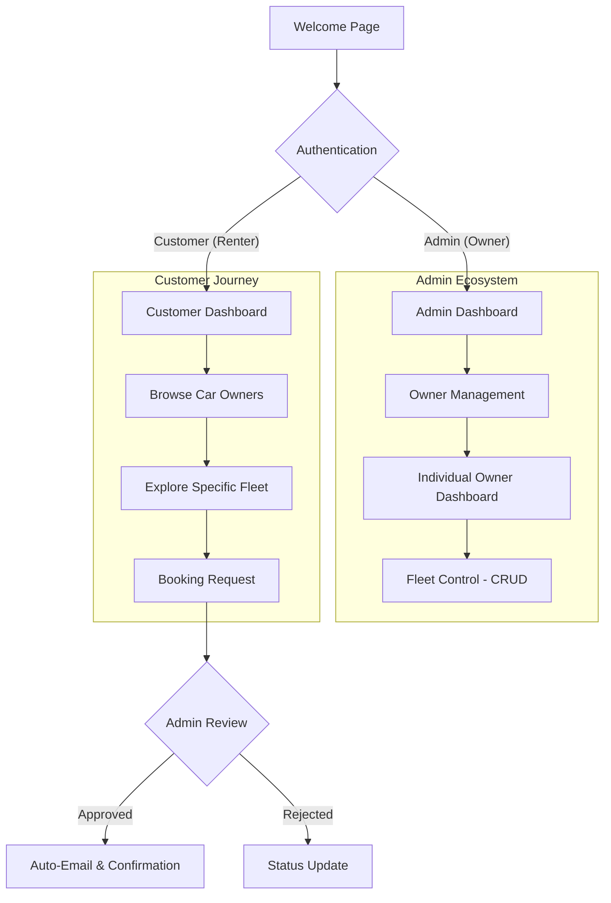

# 🚗 VEGA'S PREMIUM CAR RENTAL (Multi-Owner)

> [!NOTE]
> **Project Status**: Under Proposition (Under Prop / Prototyping Phase)

A modern, full-stack multi-owner car rental platform built with **Vanilla PHP**, **MySQL**, and **Bootstrap 5**. This version refactors the traditional system into a collaborative marketplace where multiple administrators can manage their own distinct fleets within a unified customer portal.

## 📊 System Flowchart

## ✨ Major Architectural Changes

### 🏢 Multi-Owner Infrastructure
- **Consolidated Roles**: Simplified to 2 core roles — **Admin** (acting as Car Owners) and **Customer** (Renters).
- **Owner-Specific Dashboards**: Each admin has a dedicated management space for their specific vehicle inventory.
- **Names-Based Filtering**: Fleet management now includes high-speed filtering to isolate cars by owner name.
- **Accurate Inventory Tracking**: Dashboard metrics now calculate **physical total cars** (sum of all stocks) rather than just the number of unique models.

### 🛠 Admin Module
- **Owner Grid**: Visual overview of all platform partners and their fleet sizes.
- **Direct Account Creation**: Admins can create new owner accounts via an integrated modal system.
- **Fleet Management**: Streamlined CRUD operations moved to specific owner contexts.
- **Real-Time Data**: Instant metrics for revenue and active rentals across the platform.

### 👤 Customer Module
- **Owner-First Browsing**: Users select which rental provider to browse first, ensuring transparency in management.
- **Unified Carousel/Grid**: Seamless transition from owner grid to specific vehicle collection.
- **Computed Estimations**: Real-time price calculation based on pickup and return dates.

## 🚀 Technical Stack
- **Backend**: PHP 8.x
- **Database**: MySQL (Relational Schema with owner-car associations)
- **Frontend**: Bootstrap 5, Custom Glassmorphism CSS, Vanilla JS
- **Automation**: 
  - [PHPMailer](https://github.com/PHPMailer/PHPMailer) for transactional emails.
  - [SweetAlert2](https://sweetalert2.github.io/) for professional UI feedback.

---
*Developed as a high-performance prototype for scalable rental systems.*
*Created with ❤️ by Sonjeb.
