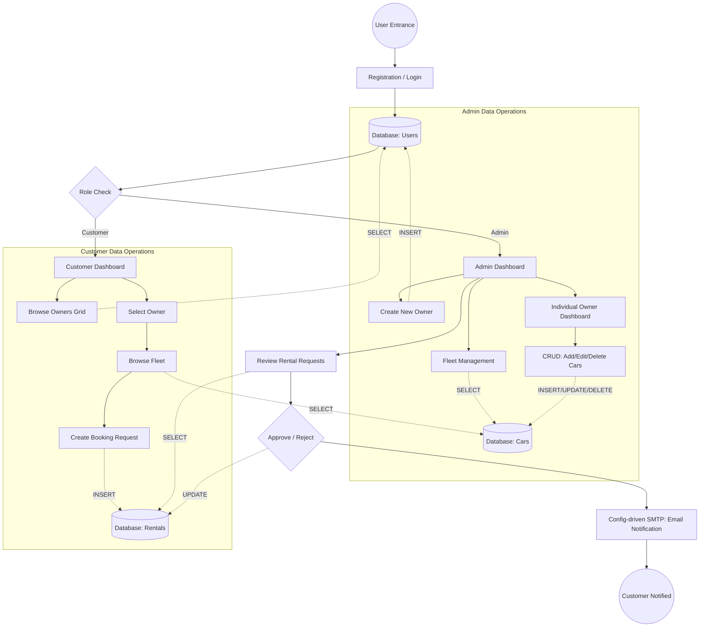

# 🚗 FILIPS CAR RENTAL (Multi-Owner MVC Platform)

> [!NOTE]
> **Project Status**: Enterprise Restructured (MVC Architecture & Rebranded)

A modern, full-stack multi-owner car rental platform built with **PHP 8.x**, **MySQL**, **Bootstrap 5**, and structured under the **Model-View-Controller (MVC)** architectural pattern. It features a collaborative marketplace where multiple administrators manage distinct vehicle fleets within a unified, high-converting customer portal.

---

## 🏗 Directory & MVC Architecture

The codebase follows a clean separation of concerns using an `app/` structure with automated class loading via `spl_autoload_register`.

```text
Car_Rental/
├── config.php                  # Database, global constants & SMTP configuration
├── index.php                   # Public landing page entry point
├── login.php                   # Auth login entry point
├── register.php                # Auth registration entry point
├── logout.php                  # Session logout entry point
├── dashboard.php               # Customer fleet browsing entry point
├── car_details.php             # Vehicle detail & rental request entry point
├── my_rentals.php              # Customer rental history entry point
├── rent_process.php            # Rental submission handler
├── admin/                      # Admin entry points & PHPMailer
│   ├── dashboard.php           # Admin overview
│   ├── cars.php                # Fleet management
│   ├── rentals.php             # Rental request approval/rejection
│   ├── owner_dashboard.php     # Individual owner dashboard
│   ├── check_pending.php       # Real-time AJAX polling endpoint
│   └── PHPMailer/              # Email dispatch library
├── app/                        # MVC Application Core
│   ├── Models/                 # Data Models & DB queries
│   │   ├── User.php            # User authentication & owner management
│   │   ├── Car.php             # Vehicle inventory & availability math
│   │   └── Rental.php          # Booking transactions & SMTP mailer
│   ├── Controllers/            # Application Controllers
│   │   ├── AuthController.php      # Login, Register, Logout controller
│   │   ├── DashboardController.php # Landing & Dashboard views controller
│   │   ├── CarController.php       # Car details & fleet CRUD controller
│   │   └── RentalController.php    # Rental processing & approval controller
│   └── Views/                  # View Templates
│       ├── includes/           # Header, sticky Navbar & Footer layouts
│       ├── auth/               # Login & Register views
│       ├── dashboard/          # Home landing, customer, admin & owner views
│       ├── cars/               # Car details & admin fleet views
│       └── rentals/            # Customer & admin rental views
├── assets/                     # Stylesheets, JS & Static Assets
└── uploads/                    # Vehicle uploaded images
```

---

## 📊 System Flowchart & Data Architecture


```mermaid
graph TD
    %% Entry Point
    Start((User Entrance)) --> Reg[Registration / Login]
    Reg --> DB_Users[(Database: Users)]
    
    %% Role Redirection
    DB_Users --> RoleCheck{Role Check}
    RoleCheck -- "Admin" --> AdminDash[Admin Dashboard]
    RoleCheck -- "Customer" --> CustDash[Customer Dashboard]
    
    %% Admin Workflows
    subgraph "Admin Data Operations"
        AdminDash --> AddOwner[Create New Owner]
        AddOwner -.->|INSERT| DB_Users
        AdminDash --> ViewFleet[Fleet Management]
        ViewFleet -.->|SELECT| DB_Cars
        AdminDash --> OwnerDash[Individual Owner Dashboard]
        OwnerDash --> ManageCars[CRUD: Add/Edit/Delete Cars]
        ManageCars -.->|INSERT/UPDATE/DELETE| DB_Cars[(Database: Cars)]
    end
    
    %% Customer Workflows
    subgraph "Customer Data Operations"
        CustDash --> BrowseOwners[Browse Owners Grid]
        BrowseOwners -.->|SELECT| DB_Users
        CustDash --> SelectOwner[Select Owner]
        SelectOwner --> BrowseFleet[Browse Fleet]
        BrowseFleet -.->|SELECT| DB_Cars
        BrowseFleet --> Booking[Create Booking Request]
        Booking -.->|INSERT| DB_Rentals[(Database: Rentals)]
    end
    
    %% Business Logic Loop
    AdminDash --> ReviewRentals[Review Rental Requests]
    ReviewRentals -.->|SELECT| DB_Rentals
    ReviewRentals --> Decision{Approve / Reject}
    Decision -.->|UPDATE| DB_Rentals
    Decision --> Mail[Config-driven SMTP: Email Notification]
    Mail --> Customer((Customer Notified))
```

---

## ✨ Recent Major Enhancements

### 📐 MVC Restructuring
- **Clean Separation of Concerns**: Decoupled presentation (`Views`), business logic (`Controllers`), and data access (`Models`).
- **Autoloading Integration**: Automatic class loading via `spl_autoload_register` handling `App\*` namespaces.
- **Controller Wrappers**: Entry scripts delegate directly to specific Controller methods (`(new DashboardController($mysqli))->home()`).

### ⚙️ Centralized SMTP Configuration
- **No Hardcoded Credentials**: Moved all mail server settings (`SMTP_HOST`, `SMTP_PORT`, `SMTP_USERNAME`, `SMTP_PASSWORD`, `SMTP_ENCRYPTION`, `SMTP_FROM_EMAIL`, `SMTP_FROM_NAME`) to [config.php](file:///c:/xampp/htdocs/Car_Rental/config.php).
- **Transactional Mailer**: `Rental` model uses PHPMailer driven strictly by configuration constants.

### 🎨 Executive Landing Page Redesign
- **Hero & Search Box**: Hero banner with subtle background animations and floating search card.
- **Metrics Section**: Interactive counters for available vehicles, customer satisfaction, and 24/7 support.
- **Boxed Content Layout**: Structured `.box-card` and `.step-card` elements for high visual appeal.
- **Reviews & CTA**: Testimonial grid and Call-To-Action conversion section.

### 📌 Fixed Sticky Navigation Header
- **Always-Accessible Header**: Applied `position: fixed !important` with backdrop blur (`backdrop-filter: blur(12px)`) so header navigation stays visible and clickable anywhere on the page when scrolling down.
- **Streamlined Navigation Links**: Header includes direct links (`Home`, `Our Fleet`, `Why Us`, `How It Works`, `Reviews`) and a single **Sign In** call-to-action button (removed redundant Register button).
- **Rebranded**: Updated brand title across all views to **FILIPS CAR RENTAL**.

---

## 🏦 Database Schema Overview
- **`users` Table**: Accounts table with `role` (`admin` / `customer`). Admins act as car owners.
- **`cars` Table**: Keyed by `owner_id` (foreign key to `users`). Stores vehicle model, year, daily rate, status, and stock `quantity`.
- **`rentals` Table**: Junction table tracking `user_id`, `car_id`, `start_date`, `end_date`, `total_price`, and `status` (`pending`, `approved`, `rejected`, `completed`).

---

## 🚀 Technology Stack
- **Backend**: PHP 8.x (MVC Architecture)
- **Database**: MySQL (Relational Schema)
- **Frontend**: Bootstrap 5, Custom Glassmorphism & Box System CSS, Vanilla JS
- **Libraries**:
  - [PHPMailer](https://github.com/PHPMailer/PHPMailer) for email dispatch.
  - [SweetAlert2](https://sweetalert2.github.io/) for UI popups and alert notifications.

---
*Developed as a high-performance prototype for scalable rental systems.*
