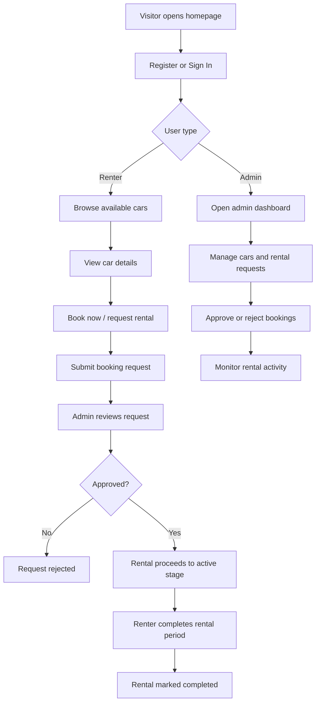

# 🚗 Car Rental System

This project is a prototype car rental web application built with PHP, MySQL, and Bootstrap. It is intended for demonstration and early-stage development, not for production deployment as-is.

## Prototype notice

This is a prototype project created for demonstration purposes. It is designed to show the core idea of a car rental workflow, including browsing cars, submitting rental requests, and managing approvals from an admin dashboard.

Features and interfaces may still evolve as the app is refined.

## Overview

This project allows:

- renters to browse available vehicles and view car details
- guests or users to register and sign in
- renters to request a booking for a selected vehicle
- admins to review pending rental requests
- admins to approve, reject, or manage rental operations

## Roles

| Role | Access |
|---|---|
| admin | full system access; manages cars, rental approvals, and dashboard operations |
| renter | browses cars, requests bookings, and views rental activity |

## Default admin login

Use the seeded admin account to access the dashboard:

- Email: admin@carental.com
- Password: admin123

## Features

- user registration and login flow
- role-based dashboard system
- car catalog with filters and details modal
- vehicle availability and booking request handling
- admin approval workflow for rentals
- rental status tracking
- responsive Bootstrap UI
- PHPMailer-based notifications

## How the system works


```mermaid
flowchart TD
    A[Visitor opens homepage] --> B[Register or Sign In]
    B --> C{User type}

    C -->|Renter| D[Browse available cars]
    D --> E[View car details]
    E --> F[Book now / request rental]
    F --> G[Submit booking request]
    G --> H[Admin reviews request]

    H --> I{Approved?}
    I -->|No| J[Request rejected]
    I -->|Yes| K[Rental proceeds to active stage]
    K --> L[Renter completes rental period]
    L --> M[Rental marked completed]

    C -->|Admin| N[Open admin dashboard]
    N --> O[Manage cars and rental requests]
    O --> P[Approve or reject bookings]
    P --> Q[Monitor rental activity]
```

## Typical user flow

1. A user visits the public site.
2. The user signs up or logs in.
3. A renter browses cars, applies filters, and opens car details.
4. The renter clicks Book Now to submit a rental request.
5. The admin receives the request in the admin dashboard.
6. The request is approved or rejected.
7. If approved, the rental proceeds to the active stage.
8. The renter can track the rental in their account area.

## Tech stack

- PHP
- MySQL
- Bootstrap 5
- PHPMailer
- MVC architecture with app/Models, app/Controllers, and app/Views

## How to clone the project

```bash
git clone https://github.com/YoursTrulyInarius/Car_Rental.git
cd Car_Rental
```

## How to run it locally

### 1) Start your local web server
Use XAMPP and make sure:

- Apache is running
- MySQL is running

### 2) Import the database
1. Open phpMyAdmin.
2. Create a database named `car_rental` or match the name configured in your project.
3. Import the SQL file from:
   - `database.sql`

### 3) Configure database connection
Edit the database settings in:

- `config.php`

Update the DB name, username, and password if needed.

### 4) Run the app
Open the browser and visit:

```text
http://localhost/Car_Rental/
```

If your project is in a different folder, use the matching local path instead.

## Project structure

```text
Car_Rental/
├── app/
│   ├── Controllers/
│   ├── Models/
│   └── Views/
├── admin/
├── assets/
├── uploads/
├── config.php
├── database.sql
├── index.php
├── login.php
├── register.php
├── dashboard.php
├── my_rentals.php
├── rent_process.php
├── README.md
├── LICENSE
├── PROJECT_OVERVIEW.md
└── other project docs
```

## Notes

- The seeded admin account is created from `database.sql`.
- The system uses two main roles: admin and renter.
- For a real production system, you should change default credentials and harden security.
- This project is meant for learning, prototyping, demo presentations, and early-stage project work.

## Status

This project is currently structured for local prototype deployment and supports a working renter-to-admin rental workflow in a demo environment.
